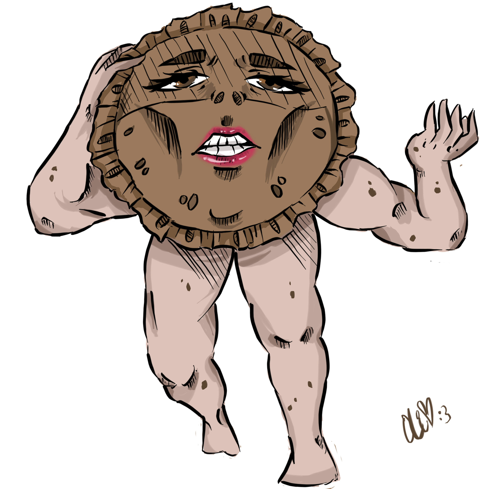

<!DOCTYPE html>
<html>
<title>PIE</title>
<meta charset="UTF-8">
<meta name="viewport" content="width=device-width, initial-scale=1">
<link rel="stylesheet" href="https://www.w3schools.com/w3css/4/w3.css">
<link rel="stylesheet" href="https://fonts.googleapis.com/css?family=Karma">

<body>

<!-- Sidebar (hidden by default) -->
<nav class="w3-sidebar w3-bar-block w3-card w3-top w3-xlarge w3-animate-left" style="display:none;z-index:2;width:40%;min-width:300px" id="mySidebar">
  <a href="javascript:void(0)" onclick="w3_close()"
  class="w3-bar-item w3-button">Close Menu</a>
  <a  href="Index.html" class="w3-bar-item w3-button">About</a>
  <a  href="Pie.html" class="w3-bar-item w3-button">Pie</a>
</nav>

<!-- Top menu -->

  

    
☰

    

    
The Pie Man

  

  
<!-- !PAGE CONTENT! -->

  
  

  
  

  <!-- About Section -->
  
  
    <h3>About Me</h3> 
    
    

      <h4><b>I am The Pie Man</b></h4>
      <h6><i>With a driven passion to share imformation about the beatiful world of pie</i></h6>
      
So Have a look around and find some cool pie recipes to try at Home

    

  

  

  

<!-- End page content -->

</body>
</html>
